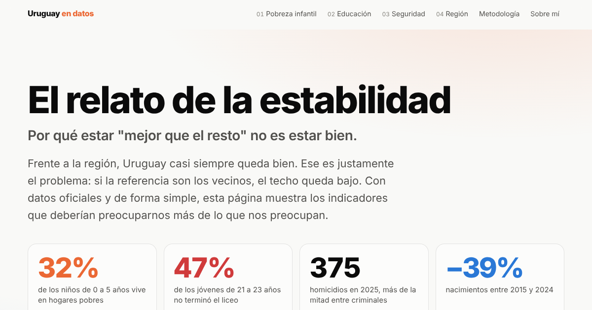

# Uruguay en datos · El relato de la estabilidad

**Por qué estar "mejor que el resto" no es estar bien.** Investigación personal con datos públicos sobre pobreza infantil, educación, seguridad, natalidad, la comparación de Uruguay con la región y lo que sí funciona. Los datos se procesan en Databricks y se muestran en una web interactiva.

🔗 **Sitio:** [datos-criticos-uy.vercel.app](https://datos-criticos-uy.vercel.app/)



---

## Hallazgos principales

| Tema | Dato | Fuente |
|---|---|---|
| Pobreza infantil | **32,2%** de los niños de 0 a 5 años vive en hogares pobres, contra **6,3%** de los mayores de 65 (2024) | INE, ECH 2024 |
| Educación | Solo el **53,2%** de los jóvenes de 21 a 23 años terminó la educación media superior (2024) | INE, ECH 2024 |
| Educación y empleo | Desempleo de 18 a 29 años: **22,8%** sin liceo completo y **17,6%** con liceo completo | INE, ECH 2024 |
| Homicidios | Los homicidios por conflictos entre criminales pasaron de **77** (2013) a **215** (2025) | Ministerio del Interior |
| Cárceles | La población presa pasó de **6.757** (2003) a **16.107** (2024) | Ministerio del Interior |
| Natalidad | Los nacimientos cayeron **39%** entre 2015 y 2024 | MSP |
| Lo que sí funciona | Uruguay es **1º de 12** (Sudamérica, Costa Rica y México) en control de la corrupción, estado de derecho, libertades, estabilidad política, electricidad renovable sin hidro (**51%**, OCDE 17%) e internet fijo | Banco Mundial (WGI y WDI) |
| Región | Uruguay tiene el desempleo juvenil más alto (**25,2%**) y la menor proporción de adultos con secundaria completa (**35%**) entre 12 países (toda Sudamérica, Costa Rica y México) | Banco Mundial |

## Estructura del repositorio

```
uruguay-en-datos/
├── index.html              # sitio web (estático)
├── assets/                 # JS (D3.js), CSS
├── data/                   # tablas gold exportadas a JSON + fuentes.json
├── notebooks/              # pipeline en Databricks (uno por capítulo)
│   ├── 00_setup                 # schema y volume en Unity Catalog
│   ├── 01_pobreza               # ECH: pobreza por edad y departamento
│   ├── 02_educacion             # ECH: egreso, ni estudian ni trabajan, desempleo
│   ├── 03_seguridad             # Ministerio del Interior: homicidios y cárceles
│   ├── 04_demografia            # MSP: nacimientos
│   ├── 05_comparacion_regional  # Banco Mundial: 9 indicadores, 12 países
│   └── 06_fortalezas            # Banco Mundial: instituciones (WGI), energía e internet
└── docs/                   # capturas
```

## Metodología

Cada notebook sigue la **arquitectura medallion**:

1. **Bronze:** el dato crudo, tal como viene de la fuente oficial.
2. **Silver:** selección de variables, limpieza y unión de años.
3. **Gold:** indicadores finales (tasas ponderadas, conteos, rankings), exportados a `data/*.json`.

La web lee esos JSON y los dibuja con D3.js. Debajo de cada gráfico aparece su fuente con un link al dataset original.

**Decisiones importantes**

- Las tasas que salen de la ECH están ponderadas con `W_ANO` (ponderador anual).
- Pobreza: variable `pobre17` (metodología INE 2017).
- Egreso de media superior: bachillerato completo en liceo (`e201_1c`) o UTU (`e201_1d`), o estudios terciarios. **Validación:** a los 21-23 años da 53,2% en 2024, contra 51,6% publicado por el INEEd para 2023.
- Comparación regional: todos los países salen de la misma fuente (Banco Mundial), para que las definiciones coincidan.

**Limitaciones**

- La ECH 2025 es de implantación, así que la comparación con 2024 es indicativa.
- Las estimaciones por departamento tienen muestras chicas, y el sitio las marca.
- Nacimientos: no hay un dataset abierto actualizado del MSP, así que las cifras se transcribieron de su informe oficial, con la fuente en cada fila.

## Fuentes

- **INE:** [Encuesta Continua de Hogares 2024, microdatos](https://www.gub.uy/instituto-nacional-estadistica/comunicacion/publicaciones/microdatos-encuesta-continua-hogares-ech-2024)
- **Ministerio del Interior:** [Delitos denunciados / homicidios](https://catalogodatos.gub.uy/dataset/ministerio-del-interior-delitos_denunciados_en_el_uruguay) y [Sistema carcelario](https://catalogodatos.gub.uy/dataset/ministerio-del-interior-sistema-carcelario)
- **MSP:** [Natalidad y mortalidad infantil 2023, informe preliminar](https://www.gub.uy/ministerio-salud-publica/sites/ministerio-salud-publica/files/documentos/publicaciones/Informe%20DIGESA_N%20y%20M%202023_final%20al%2020_03_2024_0.pdf)
- **INEEd:** [Mirador Educativo](https://mirador.ineed.edu.uy/)
- **Banco Mundial:** [World Development Indicators](https://data.worldbank.org/) y [Worldwide Governance Indicators](https://www.worldbank.org/en/publication/worldwide-governance-indicators)

## Cómo reproducirlo

1. Crear una cuenta en [Databricks Free Edition](https://www.databricks.com/learn/free-edition) y conectar este repo como Git folder.
2. Correr `notebooks/00_setup`.
3. Descargar los microdatos de la ECH 2024 y 2025 del INE y subirlos al volume `raw`. Los demás notebooks descargan sus datos solos.
4. Correr los notebooks en orden. Cada uno exporta sus JSON a `data/`.
5. Servir el sitio localmente: `python3 -m http.server` en la raíz del repo y abrir `http://localhost:8000`.

## Stack

Databricks (PySpark, Delta Lake, Unity Catalog) · D3.js · HTML/CSS · Vercel

## Uso de inteligencia artificial

Este proyecto se hizo con ayuda de inteligencia artificial (**Claude, de Anthropic**) para el código de la web, los gráficos y el procesamiento de los datos. La elección de los temas, las ideas y el enfoque de cada texto son míos; la redacción la trabajé junto a la IA, y revisé cada dato contra su fuente oficial.

## Autor

**Facundo Geisinger**, estudiante de Ciencia de Datos (Universidad de Montevideo). [GitHub](https://github.com/FacuGeisinger2003)

## Licencia

El código está bajo licencia [MIT](LICENSE). Los datos pertenecen a sus fuentes oficiales y se usan según sus términos de publicación.
